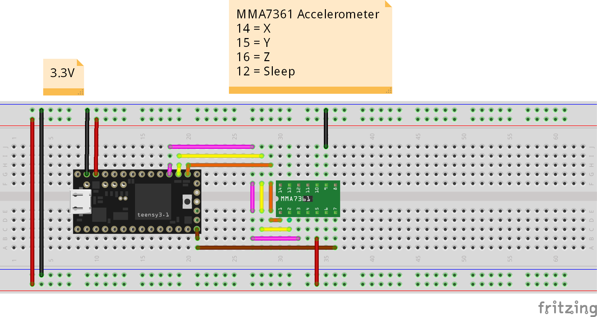

# Static Calibration

You should obtain some calibration values for your device using the [dynamic calibration example](../dynamic-calibration).

Once your device calibration values are obtained, you can statically calibrate your sensor.

## Setup

To specify your calibration:
``` cpp
Mma7361Calibration calibration;
calibration.xMin = 234;
calibration.xMax = 727;
calibration.yMin = 283;
calibration.yMax = 782;
calibration.zMin = 218;
calibration.zMax = 704;

Mma7361 sensor;
sensor.calibrate(calibration);
```

## Usage

``` cpp
// Update from sensor
int x = analogRead(xPin);
int y = analogRead(yPin);
int z = analogRead(zPin);
sensor.update(x, y, z);

// Get the G Force
double gForce = sensor.getGForce(); 
Serial.println("");
Serial.print("G=");
Serial.print(gForce);

// Get the force vector
ForceVector vector = sensor.getForceVector();
Serial.println("");
Serial.print("X=");
Serial.print(vector.x);
Serial.print("Y=");
Serial.print(vector.y);
Serial.print("Z=");
Serial.print(vector.z);
```

# Environment

These examples are intended to be used with the following environment

## Software
 - [PlatformIO](platformio.org) 
 - [CLion](https://www.jetbrains.com/clion/)

## Hardware
 - [Teensy 3.1](https://www.pjrc.com/teensy/teensy31.html) (Arduino derivative)

## Wiring


## Compiling
 - `platformio init`
 - `platformio run --target upload`